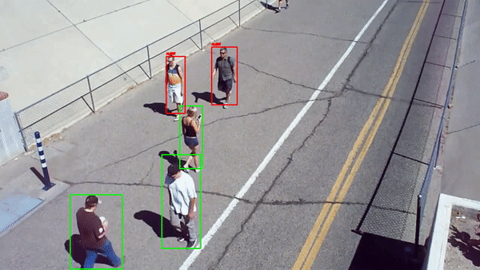

# social_distance_tracker
 In this project we will detect peoples who are not maintaining a social distance in a video frame.
 The main code is in "social_distance_tracker.py" and i have also included colab file with same code "social_distance_tracker.ipynb".
 
 ### We have used yolov3 in openCV for detecting peoples. The coco dataset has 80 categories.
 
 ### To learn more about yolo object detection using openCV, you can go through these articles.
   https://pysource.com/2019/06/27/yolo-object-detection-using-opencv-with-python/
   https://www.learnopencv.com/deep-learning-based-object-detection-using-yolov3-with-opencv-python-c/
       
## This is the generated output:

